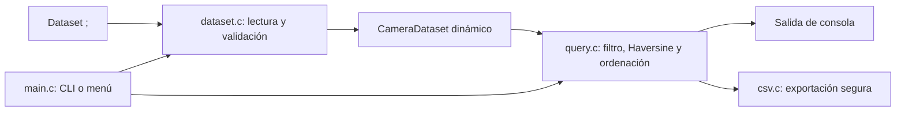

# VIASEGURA

Herramienta C11 para consultar un inventario de cámaras, validar su dataset y resolver búsquedas geográficas por radio. Funciona como CLI automatizable y conserva un menú interactivo para exploración manual.

> El dataset incluido es académico. Antes de usar datos reales deben revisarse su licencia, finalidad, minimización y requisitos de privacidad aplicables.

## Ejemplo rápido

```bash
cmake -S . -B build -DCMAKE_BUILD_TYPE=Release
cmake --build build

./build/VIASEGURA \
  --lat 40.4168 \
  --lon -3.7038 \
  --radius 3
```

La salida muestra las cámaras dentro del radio, ordenadas de menor a mayor distancia:

```text
KM         ID       ZONA               DIRECCION
1.188      124      LAVAPIES           Calle Olmo 16
1.189      123      LAVAPIES           Sta Isabel Buenavista
...
```

Filtrar por zona y exportar el resultado:

```bash
./build/VIASEGURA \
  --data data/videovigilancia.txt \
  --lat 40.4168 --lon -3.7038 --radius 3 \
  --zone LAVAPIES \
  --csv camaras-cercanas.csv
```

Para abrir el menú original basta ejecutar `./build/VIASEGURA`. También se mantiene el formato compatible `./build/VIASEGURA ruta/datos.txt`.

## Funcionalidades

- Carga dinámica: no existe un máximo artificial de 200 registros.
- Validación estricta del número de campos, longitudes, números y rangos geográficos.
- Distancia Haversine entre dos cámaras.
- Búsqueda de cámaras a menos de `X` km de una coordenada.
- Ordenación estable por distancia e ID.
- Filtro exacto por zona.
- Estadísticas y listado por zona en modo interactivo.
- Detección de ubicaciones con varios dispositivos.
- Exportación CSV con campos escapados correctamente.
- Errores de fichero, escritura y cierre propagados al proceso llamante.

## Formato de entrada

La primera línea es la cabecera. Cada registro contiene exactamente siete campos separados por `;`:

```text
ID Cartel;Ubicacion;Anyo;Zona;Latitud;Longitud;Direccion
101;Gta Embajadores Miguel Servet;2009;LAVAPIES;40.42107;-3.72026;Gta Embajadores Miguel Servet
```

Restricciones principales:

- latitud entre `-90` y `90`;
- longitud entre `-180` y `180`;
- identificador no vacío;
- campos dentro de los tamaños documentados en `camera.h`;
- sin campos adicionales ni líneas truncadas.

Ante un registro inválido la carga falla indicando fichero y línea. Esto evita producir resultados silenciosamente incorrectos.

## Arquitectura



| Módulo | Responsabilidad |
| --- | --- |
| `camera.h` | Modelo de datos y límites de los campos. |
| `dataset.c` | Entrada, validación y almacenamiento dinámico. |
| `geo.c` | Validación de coordenadas y fórmula Haversine. |
| `query.c` | Búsqueda por radio, filtro y ordenación. |
| `csv.c` | Serialización CSV y errores de salida. |
| `main.c` | Argumentos CLI y experiencia interactiva. |

## Pruebas y sanitizers

```bash
cmake -S . -B build -DCMAKE_BUILD_TYPE=Debug
cmake --build build
ctest --test-dir build --output-on-failure
```

La suite cubre distancia cero, un grado sobre el ecuador, antípodas, coordenadas límite, rechazo de coordenadas inválidas, carga del dataset, filtro de zona, radio y ordenación. También ejecuta la CLI real.

```bash
cmake -S . -B build-asan -DENABLE_SANITIZERS=ON -DCMAKE_BUILD_TYPE=Debug
cmake --build build-asan
ctest --test-dir build-asan --output-on-failure
```

GitHub Actions compila y prueba con GCC y Clang, además de ejecutar AddressSanitizer y UndefinedBehaviorSanitizer.

## Autoría

Proyecto académico original desarrollado por David Arévalo Rey, Alberto Martín Gómez y Daniel Vela Quimbay. La reorganización posterior convierte la práctica en una aplicación CLI modular y comprobable.
